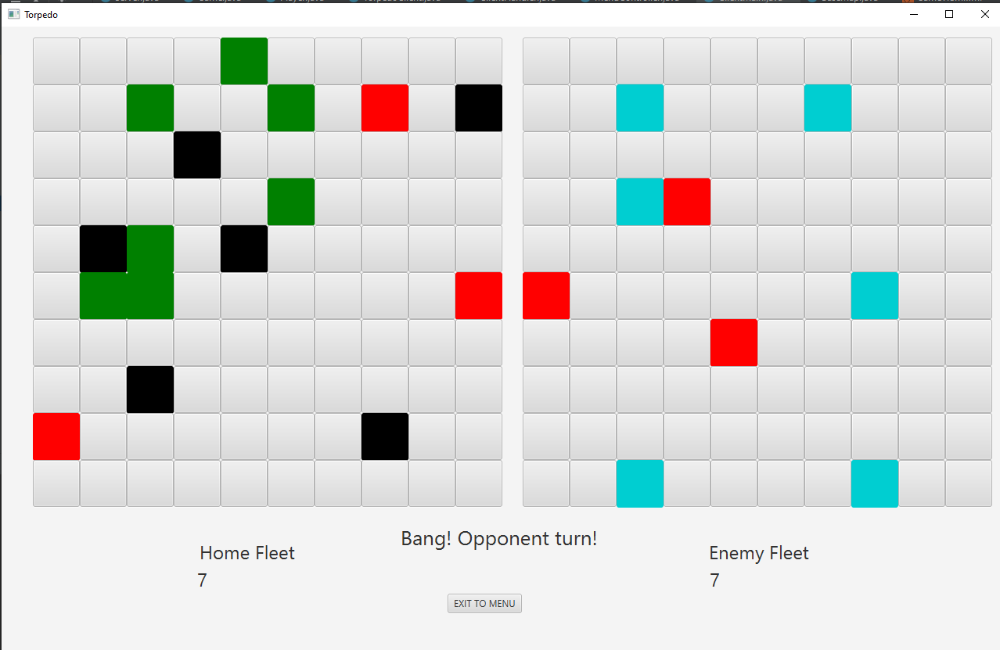
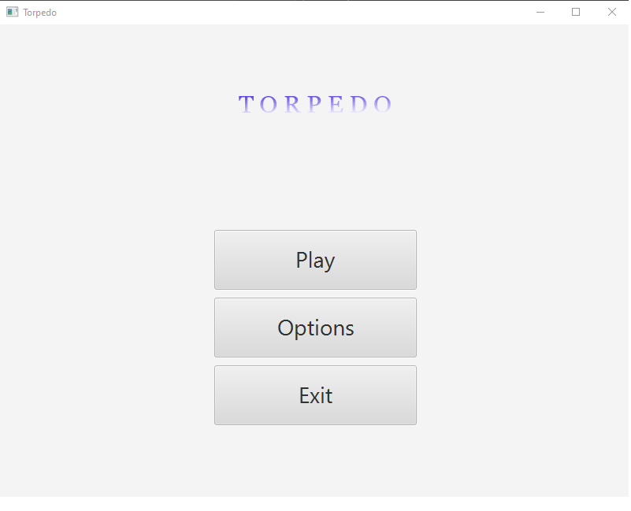

# Multiplayer Torpedo Game in Java

## Description

A two-player game in which players are tasked with placing ships on their own half of their space and then trying to shoot down enemy ships. 
Players can only shoot one in a round, but however if they hit one of the enemy ships then can shoot again until the shot is missed. 
You can only shoot where the player has not shot yet. Enemy ships are not seen by opponents unless they have hit the ship. 
Players have two boards at their disposal: the first for their own, the second for the opponent on which the attack takes place. 
The player who destroys first all enemy ships wins.

## Usage

1. Start the Server.

2. Start 2 clients.

3. Play!. Enjoy :)